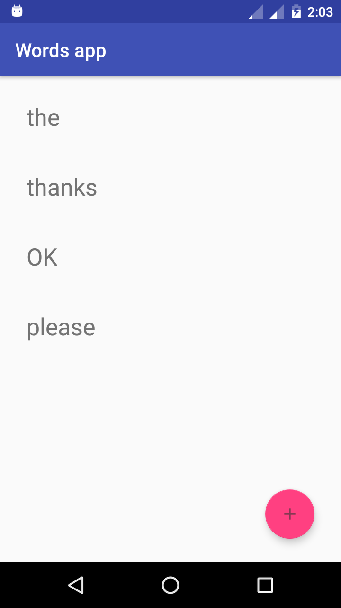
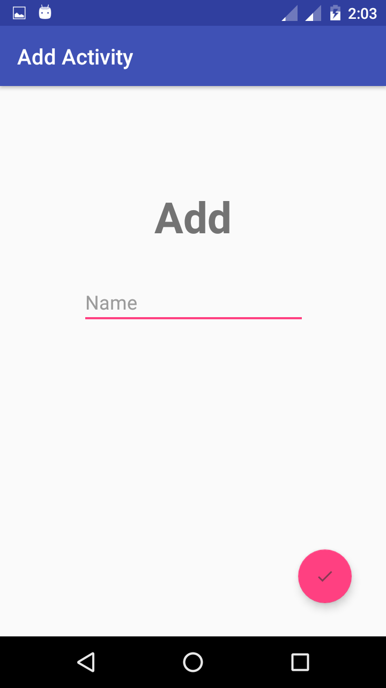
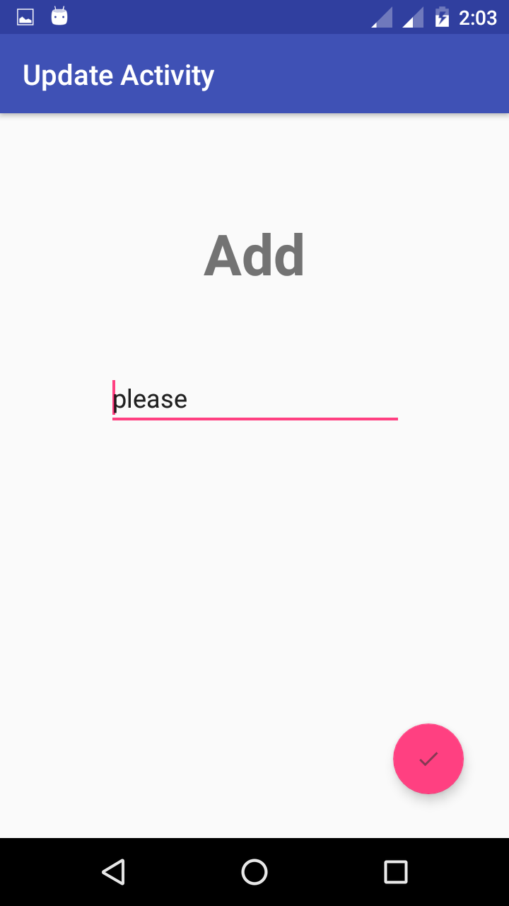
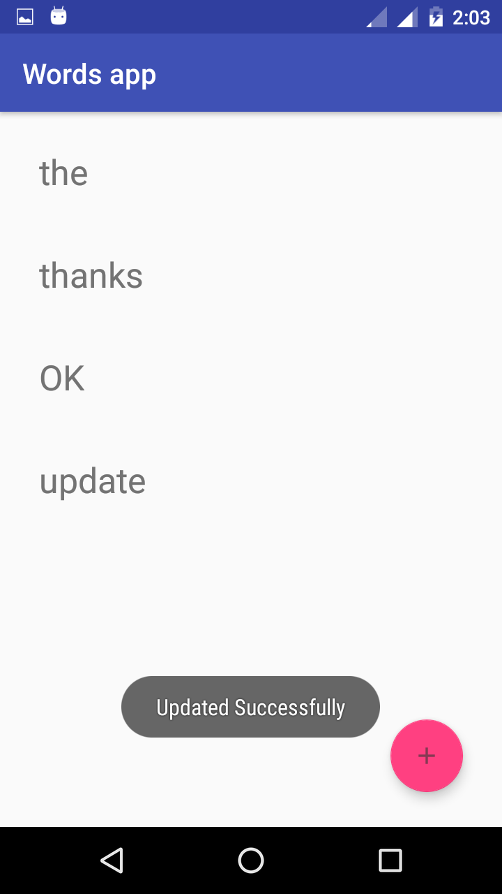
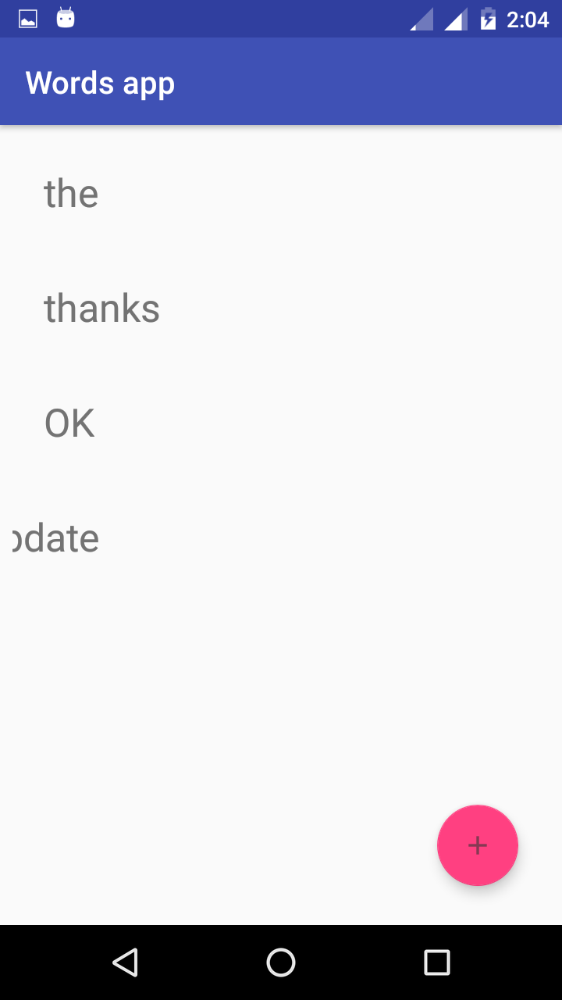

# Words app Sqlite Example.

Words app this is the old way of saving data to database in Sqlite Android.Word app in which you can words names,delete,update.

Database Operation:-

1) Insert.
2) Delete.
3) Update.

### Problem:-

When you delete word from the list the gets deleted but the list does not update. You have close app than open again then you will see updated list.

### Check this same Words app Made with Room persistence library.

https://github.com/krunalpatel3/Works-app-Room-Datadase-Example-AAC

## Screenshots:-

  

 

